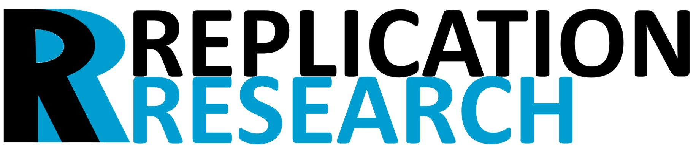
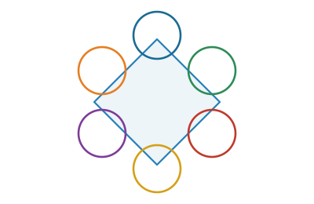
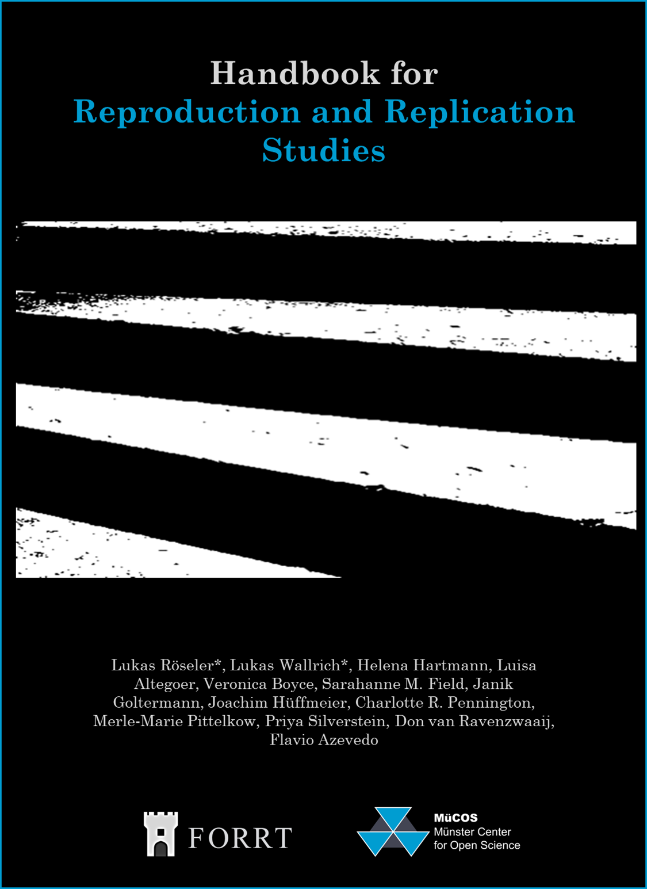
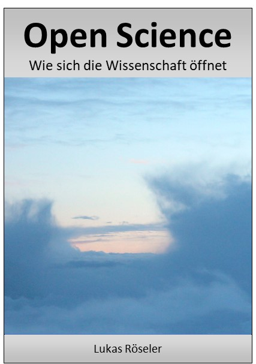
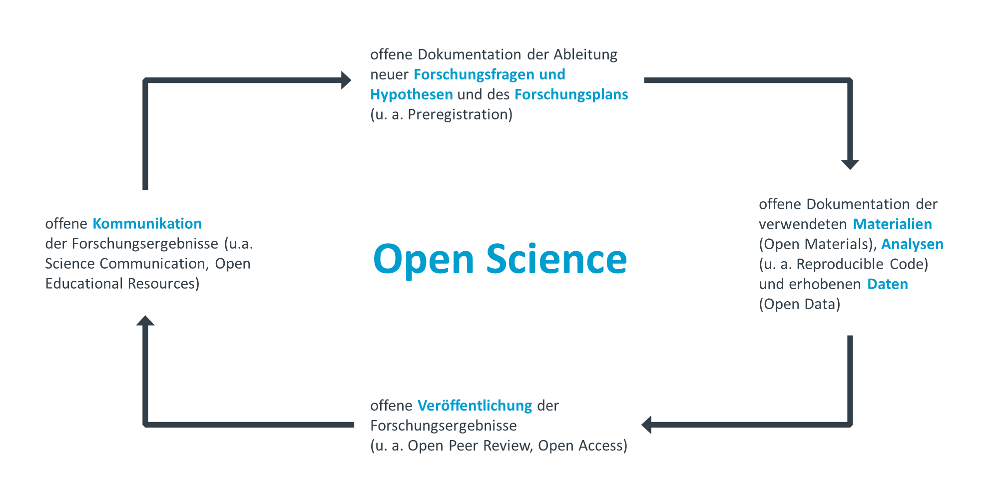

```{=html}
<!--
  ══════════════════════════════════════════
  WORD CLOUD
  ══════════════════════════════════════════
-->
<div id="wordcloud-wrapper">
  <canvas id="wc-canvas" width="900" height="230"
          style="width:100%;height:auto;display:block"></canvas>
  <p class="wc-note">Key topics based on Google Scholar profile</p>
</div>
<script src="https://cdnjs.cloudflare.com/ajax/libs/wordcloud2.js/1.1.0/wordcloud2.min.js"></script>
<script>
document.addEventListener('DOMContentLoaded', function(){
  var words = [
    ['Anchoring Effects',38],['Replication',34],['Meta-Analysis',28],
    ['Open Science',26],['Judgment & Decision Making',22],['Reproducibility',20],
    ['Preregistration',17],['Replication Database',17],['Susceptibility',15],
    ['Adjustment',14],['Ego Depletion',12],['Open Data',11],
    ['Self-Control',11],['Body Position',10],['Effect Sizes',10],
    ['Meta-Science',10],['P-Hacking',9],['Publication Bias',8],
    ['Social Psychology',8],['Personality',7],['Dominance',7],
    ['Prestige',6],['Generalizability',6],['FLoRA',6],
    ['FORRT',5],['Validity',5],['Transparency',5],['Subliminal Priming',7]
  ];
  function css(v){ return getComputedStyle(document.documentElement).getPropertyValue(v).trim(); }
  function draw(){
    var c = document.getElementById('wc-canvas');
    if(!c) return;
    c.getContext('2d').clearRect(0,0,c.width,c.height);
    var a = css('--accent')||'#03a1fc', m = css('--text-muted')||'#5a6278';
    var pal = [a,a,a,m,m,a+'cc',a+'99',m+'dd',m+'bb'];
    WordCloud(c,{
      list:words,
      gridSize:Math.round(14*(c.offsetWidth/900)),
      weightFactor:function(s){return Math.pow(s,0.82)*(c.offsetWidth/900)*2.4;},
      fontFamily:'DM Sans,sans-serif',fontWeight:'600',
      color:function(){return pal[Math.floor(Math.random()*pal.length)];},
      rotateRatio:0,rotationSteps:1,backgroundColor:'transparent',
      drawOutOfBound:false,shrinkToFit:true,shuffle:false
    });
  }
  draw();
  new MutationObserver(function(){setTimeout(draw,80);})
    .observe(document.documentElement,{attributes:true,attributeFilter:['data-bs-theme']});
});
</script>

<!--
  ══════════════════════════════════════════════════════
  PROJECT SLIDESHOW  (Karteikarten)
  To add a card: copy a .project-card block and
  increment ssTotal in the script.
  ══════════════════════════════════════════════════════
-->
<div class="project-slideshow">
  <div class="project-cards-outer">
    <div class="project-cards-track" id="ss-track">

      <!-- CARD 1: FLoRA / FORRT Replication Hub -->
      <div class="project-card">
        <div class="card-logo-wrap">
          
        </div>
        <h3>FORRT Replication Hub &amp; FLoRA Database</h3>
        <p>I am a lead on the <strong>FORRT Replication Hub</strong>, home to
           <strong>FLoRA</strong> — the world's largest curated database of replication
           studies, tracking reproductions and replications across the sciences and
           humanities. Get in touch if you would like to contribute.</p>
        <a href="https://forrt.org/replication-hub" target="_blank" class="card-cta">
          <svg viewBox="0 0 24 24" fill="none" stroke="currentColor" stroke-width="2" stroke-linecap="round" width="13" height="13"><path d="M10 6H6a2 2 0 00-2 2v10a2 2 0 002 2h10a2 2 0 002-2v-4M14 4h6m0 0v6m0-6L10 14"/></svg>
          Visit FORRT Replication Hub
        </a>
      </div>

      <!-- CARD 2: Replication Research Journal -->
      <div class="project-card">
        <div class="card-logo-wrap">
          
        </div>
        <h3>Replication Research (R2) — Diamond Open Access Journal</h3>
        <p>Together with an interdisciplinary team of Open Science experts, I am founding
           and editing <strong>Replication Research (R2)</strong> — a diamond open access
           journal dedicated to replication and reproduction studies. No fees for authors
           or readers. Get in touch to submit or support the initiative.</p>
        <a href="https://replicationresearch.org" target="_blank" class="card-cta">
          <svg viewBox="0 0 24 24" fill="none" stroke="currentColor" stroke-width="2" stroke-linecap="round" width="13" height="13"><path d="M10 6H6a2 2 0 00-2 2v10a2 2 0 002 2h10a2 2 0 002-2v-4M14 4h6m0 0v6m0-6L10 14"/></svg>
          Visit Replication Research
        </a>
      </div>

      <!-- CARD 3: Replication Journal Federation -->
      <div class="project-card">
        <div class="card-logo-wrap">
          
          <span style="font-weight:700;font-size:1rem;color:var(--text);line-height:1.3;margin-left:10px;font-family:'DM Sans',sans-serif">Replication Journal<br>Federation</span>
        </div>
        <h3>Replication Journal Federation</h3>
        <p>I am coordinating the <strong>Replication Journal Federation</strong> — a
           growing international network of journals committed to publishing replication
           and reproduction studies. The Federation promotes cross-journal standards,
           visibility, and discoverability of replication research across disciplines.</p>
        <a href="https://replicationresearch.org" target="_blank" class="card-cta">
          <svg viewBox="0 0 24 24" fill="none" stroke="currentColor" stroke-width="2" stroke-linecap="round" width="13" height="13"><path d="M10 6H6a2 2 0 00-2 2v10a2 2 0 002 2h10a2 2 0 002-2v-4M14 4h6m0 0v6m0-6L10 14"/></svg>
          Learn more
        </a>
      </div>

    </div>
  </div>

  <div class="slideshow-nav">
    <button class="ss-btn" onclick="ssPrev()" aria-label="Previous">
      <svg viewBox="0 0 24 24"><polyline points="15 18 9 12 15 6"/></svg>
    </button>
    <div class="ss-dots" id="ss-dots"></div>
    <button class="ss-btn" onclick="ssNext()" aria-label="Next">
      <svg viewBox="0 0 24 24"><polyline points="9 18 15 12 9 6"/></svg>
    </button>
  </div>
</div>

<script>
(function(){
  var ssTotal = 3; /* ← increment when adding cards */
  var track = document.getElementById('ss-track');
  var dotsEl = document.getElementById('ss-dots');
  var cur = 0, timer;
  for(var i=0;i<ssTotal;i++){
    (function(idx){
      var d = document.createElement('button');
      d.className = 'ss-dot'+(idx===0?' active':'');
      d.setAttribute('aria-label','Card '+(idx+1));
      d.addEventListener('click',function(){ ssGoTo(idx); });
      dotsEl.appendChild(d);
    })(i);
  }
  function ssGoTo(n){
    cur = ((n%ssTotal)+ssTotal)%ssTotal;
    track.style.transform = 'translateX(-'+cur*100+'%)';
    dotsEl.querySelectorAll('.ss-dot').forEach(function(d,i){
      d.classList.toggle('active',i===cur);
    });
    clearInterval(timer);
    timer = setInterval(function(){ ssGoTo(cur+1); },7000);
  }
  window.ssPrev = function(){ ssGoTo(cur-1); };
  window.ssNext = function(){ ssGoTo(cur+1); };
  timer = setInterval(function(){ ssGoTo(cur+1); },7000);
})();
</script>
```

<p style="font-family:'DM Sans',sans-serif">My research covers Replications, Meta-Science, and Judgment and Decision Making (e.g., Anchoring Effects).</p>

```{=html}
<!--
  ══════════════════════════════════════════════════════════
  OPEN EDUCATIONAL RESOURCES  (4-column grid)
  To add a card: copy an <a class="oer-card"> block.
  ══════════════════════════════════════════════════════════
-->
<details class="collapsible-section" open>
<summary>
  <div class="coll-chevron"><svg viewBox="0 0 24 24"><polyline points="9 18 15 12 9 6"/></svg></div>
  <h2>Open Educational Resources</h2>
</summary>
<div class="section-body">

<div class="oer-grid">

  <!-- Card 1: Replication Handbook -->
  <a class="oer-card" href="https://forrt.org/replication_handbook" target="_blank">
    
    <div class="oer-body">
      <div class="oer-title">Handbook for Reproduction &amp; Replication Studies</div>
      <div class="oer-desc">Open access handbook co-authored with international experts. Covers methods, standards, and best practices for replication research.</div>
      <span class="oer-link">
        Read online
        <svg viewBox="0 0 24 24"><path d="M5 12h14M12 5l7 7-7 7"/></svg>
      </span>
    </div>
  </a>

  <!-- Card 2: German Open Science Book -->
  <a class="oer-card" href="https://lukasroeseler.github.io/opensciencebuch/" target="_blank">
    
    <div class="oer-body">
      <div class="oer-title">Open Science: Wie sich die Wissenschaft öffnet</div>
      <div class="oer-desc">A German-language open access book on Open Science — freely available online and continuously updated.</div>
      <span class="oer-link">
        Read online
        <svg viewBox="0 0 24 24"><path d="M5 12h14M12 5l7 7-7 7"/></svg>
      </span>
    </div>
  </a>

  <!-- Card 3: MueCOS Infomodule -->
  <a class="oer-card" href="https://lukasroeseler.github.io/MueCOS-Infomodule/" target="_blank">
    
    <div class="oer-body">
      <div class="oer-title">Interdisciplinary Open Science Guide (MueCOS)</div>
      <div class="oer-desc">An interdisciplinary guide to Open Science prepared with experts from the University of Münster. German, work in progress.</div>
      <span class="oer-link">
        Open guide
        <svg viewBox="0 0 24 24"><path d="M5 12h14M12 5l7 7-7 7"/></svg>
      </span>
    </div>
  </a>

  <!-- Card 4: Teaching slides / OSF repository -->
  <a class="oer-card" href="https://osf.io/at29b/" target="_blank">
    <div class="oer-pictogram">
      <svg viewBox="0 0 80 80" fill="none" xmlns="http://www.w3.org/2000/svg">
        <rect x="8" y="10" width="64" height="40" rx="4"
              fill="var(--bg-card2)" stroke="var(--accent)" stroke-width="2.5"/>
        <line x1="18" y1="24" x2="50" y2="24" stroke="var(--accent)" stroke-width="2" stroke-linecap="round" opacity=".7"/>
        <line x1="18" y1="32" x2="44" y2="32" stroke="var(--accent)" stroke-width="2" stroke-linecap="round" opacity=".5"/>
        <line x1="18" y1="40" x2="38" y2="40" stroke="var(--accent)" stroke-width="2" stroke-linecap="round" opacity=".35"/>
        <line x1="22" y1="50" x2="14" y2="68" stroke="var(--text-muted)" stroke-width="2.5" stroke-linecap="round"/>
        <line x1="58" y1="50" x2="66" y2="68" stroke="var(--text-muted)" stroke-width="2.5" stroke-linecap="round"/>
        <line x1="40" y1="50" x2="40" y2="68" stroke="var(--text-muted)" stroke-width="2" stroke-linecap="round" opacity=".5"/>
        <circle cx="62" cy="22" r="5" fill="var(--text-muted)" opacity=".6"/>
        <path d="M58 38 Q62 28 66 38" fill="var(--text-muted)" opacity=".45"/>
      </svg>
    </div>
    <div class="oer-body">
      <div class="oer-title">Workshops, Lectures &amp; Teaching Slides</div>
      <div class="oer-desc">Slides and materials from workshops, lectures, talks, and seminars on Open Science and replication methods. Hosted on OSF.</div>
      <span class="oer-link">
        Browse OSF repository
        <svg viewBox="0 0 24 24"><path d="M5 12h14M12 5l7 7-7 7"/></svg>
      </span>
    </div>
  </a>

</div><!-- /oer-grid -->
</div></details>
```

## Research Articles — Searchable Table

```{=html}
<p style="font-family:'DM Sans',sans-serif;color:var(--text-muted);font-size:0.95rem;margin-bottom:1.2rem">
Filter by topic or search by author and title. Click any row to expand full details and open science badges.
</p>
```

```{=html}
<!-- research_data.js is generated by _pre-render.R from research.xlsx -->
<script src="research_data.js"></script>
```

```{=html}
<svg style="display:none" xmlns="http://www.w3.org/2000/svg">
  <symbol id="ic-search"  viewBox="0 0 24 24" fill="none" stroke="currentColor" stroke-width="2" stroke-linecap="round"><circle cx="11" cy="11" r="8"/><line x1="21" y1="21" x2="16.65" y2="16.65"/></symbol>
  <symbol id="ic-chevron" viewBox="0 0 24 24" fill="none" stroke="currentColor" stroke-width="2.5" stroke-linecap="round" stroke-linejoin="round"><polyline points="6 9 12 15 18 9"/></symbol>
  <symbol id="ic-anchor"  viewBox="0 0 24 24" fill="none" stroke="currentColor" stroke-width="2" stroke-linecap="round"><circle cx="12" cy="5" r="3"/><line x1="12" y1="8" x2="12" y2="21"/><path d="M5 12H2a10 10 0 0020 0h-3"/></symbol>
  <symbol id="ic-refresh" viewBox="0 0 24 24" fill="none" stroke="currentColor" stroke-width="2" stroke-linecap="round"><polyline points="1 4 1 10 7 10"/><path d="M3.51 15a9 9 0 102.13-9.36L1 10"/></symbol>
  <symbol id="ic-flask"   viewBox="0 0 24 24" fill="none" stroke="currentColor" stroke-width="2" stroke-linecap="round"><path d="M9 3H5a2 2 0 00-2 2v4m6-6h10a2 2 0 012 2v4M9 3v11l-4 7h14l-4-7V3"/></symbol>
  <symbol id="ic-book"    viewBox="0 0 24 24" fill="none" stroke="currentColor" stroke-width="2" stroke-linecap="round"><path d="M4 19.5A2.5 2.5 0 016.5 17H20"/><path d="M6.5 2H20v20H6.5A2.5 2.5 0 014 19.5v-15A2.5 2.5 0 016.5 2z"/></symbol>
</svg>

<script>
var BADGE = {
  openmaterials: 'https://github.com/LukasRoeseler/home/blob/main/images/openmaterials.png?raw=true',
  preregistered: 'https://github.com/LukasRoeseler/home/blob/main/images/preregistered.png?raw=true',
  opencode:      'https://github.com/LukasRoeseler/home/blob/main/images/opencode.png?raw=true',
  opendata:      'https://github.com/LukasRoeseler/home/blob/main/images/opendata.png?raw=true'
};
var rtCurTopic = 'all', rtCurSearch = '';

function oaClass(s){
  if(!s) return 'green'; var l=s.toLowerCase();
  if(l.includes('diamond')) return 'diamond';
  if(l.includes('gold'))    return 'gold';
  if(l.includes('software'))return 'software';
  if(l.includes('preprint'))return 'preprint';
  if(l.includes('closed'))  return 'closed';
  return 'green';
}
function oaShort(s){
  if(!s) return '—';
  if(s.toLowerCase().includes('diamond'))  return 'Diamond';
  if(s.toLowerCase().includes('gold'))     return 'Gold';
  if(s.toLowerCase().includes('software')) return 'Software';
  if(s.toLowerCase().includes('preprint')) return 'Preprint';
  if(s.toLowerCase().includes('closed'))   return 'Closed';
  return s.split(' ')[0];
}
function isValid(v){
  return v && v.trim() && v.trim()!=='NA'
    && v.trim()!=='Does not apply.' && v.trim()!=='Link';
}
function extractTitle(ref){
  /* Remove leading author block: everything up to the first year pattern "(YYYY" or "YYYY," */
  var s = String(ref||'');
  /* Strip author prefix: up to and including the year + closing paren or comma */
  s = s.replace(/^.{0,120}?\(\d{4}[^)]*\)\.\s*/,'');
  /* Also handle year without parens at start: "Author (YYYY). Title..." */
  /* Take text up to the first ". " that looks like end-of-title (before journal/DOI) */
  /* Split on ". " and take first chunk, unless it's too short */
  var parts = s.split(/\.\s+/);
  var title = parts[0] || s;
  /* If result still contains a DOI or URL, trim it */
  title = title.replace(/https?:\/\/.*/,'').trim();
  /* Remove trailing period */
  title = title.replace(/\.+$/,'').trim();
  /* Cap length */
  if(title.length > 120) title = title.slice(0,117) + '…';
  return title || s.slice(0,100);
}
  var b='';
  if(isValid(d.materials))
    b+='<a class="os-badge-link" href="'+d.materials.trim()+'" target="_blank" title="Open Materials / Data"></a>';
  if(isValid(d.prereg)){
    var pu=d.prereg.trim().split(/\s+/)[0];
    b+='<a class="os-badge-link" href="'+pu+'" target="_blank" title="Preregistered"></a>';
  }
  if(isValid(d.preprint))
    b+='<a class="os-badge-link" href="'+d.preprint.trim()+'" target="_blank" title="Preprint available"></a>';
  return b||'<span style="color:var(--text-muted);font-size:0.8rem">—</span>';
}
function buildRow(d){
  var topics=String(d.topic||'').split('/').map(function(t){return t.trim();});
  var topicBadges=topics.map(function(t){return '<span class="rt-topic">'+t+'</span>';}).join(' ');
  var num=d.num||'';
  var expId='rt-exp-'+num+'-'+Math.random().toString(36).slice(2,6);
  var links='';
  if(isValid(d.materials)) links+='<div><a href="'+d.materials.trim()+'" target="_blank" style="color:var(--accent)">Materials &amp; Data</a></div>';
  if(isValid(d.prereg)){
    var purls=d.prereg.trim().split(/\s+/).filter(function(u){return u.length>4;});
    purls.forEach(function(u,i){
      links+='<div><a href="'+u+'" target="_blank" style="color:var(--accent)">Preregistration'+(purls.length>1?' '+(i+1):'')+'</a></div>';
    });
  }
  if(isValid(d.preprint)) links+='<div><a href="'+d.preprint.trim()+'" target="_blank" style="color:var(--accent)">Preprint</a></div>';
  var sb=(d.student&&String(d.student).toLowerCase().includes('yes'))
    ?'<div><span style="background:var(--accent-dim);color:var(--accent);border-radius:5px;padding:2px 8px;font-size:0.71rem;font-weight:600">Student collaboration</span></div>':'';
  return '<tr class="rt-main-row" data-topic="'+String(d.topic||'')+'" data-search="'+(String(d.ref||'')+' '+String(d.topic||'')).toLowerCase()+'" onclick="rtToggle(\''+expId+'\',this)" title="Click for details">'
    +'<td><strong style="color:var(--accent)">'+num+'</strong></td>'
    +'<td>'+topicBadges+'</td>'
    +'<td style="font-size:0.85rem"><span class="rt-title">'+extractTitle(d.ref)+'</span></td>'
    +'<td><span class="rt-oa '+oaClass(d.oatype)+'">'+oaShort(d.oatype)+'</span></td>'
    +'<td><div class="os-badges">'+osBadges(d)+'</div></td>'
    +'<td><button class="rt-expand-btn" id="btn-'+expId+'" title="Expand"><svg width="13" height="13"><use href="#ic-chevron"/></svg></button></td>'
    +'</tr>'
    +'<tr class="rt-expanded-row hidden" id="'+expId+'"><td colspan="6">'
    +'<div style="display:flex;gap:20px;flex-wrap:wrap;align-items:flex-start">'
    +'<div style="flex:1;min-width:200px"><strong style="color:var(--accent);font-size:0.72rem;letter-spacing:.05em;text-transform:uppercase">Reference</strong><br>'
    +'<span style="color:var(--text);font-size:0.875rem">'+String(d.ref||'')+'</span></div>'
    +'<div style="display:flex;flex-direction:column;gap:6px;font-size:0.855rem;min-width:170px">'+sb+links+'</div>'
    +'</div></td></tr>';
}
function rtToggle(id,row){
  var exp=document.getElementById(id),btn=document.getElementById('btn-'+id);
  if(!exp) return;
  var open=!exp.classList.contains('hidden');
  exp.classList.toggle('hidden',open);
  if(btn) btn.classList.toggle('open',!open);
}
function rtRender(){
  var tbody=document.getElementById('rt-tbody'),noRes=document.getElementById('rt-no-results'),
      tbl=document.getElementById('rt-table'),cntEl=document.getElementById('rt-count');
  if(!tbody||typeof RT_DATA==='undefined') return;
  var filtered=RT_DATA.filter(function(d){
    var topicOk=rtCurTopic==='all'||String(d.topic||'').toLowerCase().includes(rtCurTopic.toLowerCase());
    var searchOk=!rtCurSearch||(String(d.ref||'')+' '+String(d.topic||'')).toLowerCase().includes(rtCurSearch);
    return topicOk&&searchOk;
  });
  tbody.innerHTML=filtered.map(buildRow).join('');
  noRes.style.display=filtered.length===0?'block':'none';
  tbl.style.display=filtered.length===0?'none':'';
  cntEl.textContent=filtered.length+' of '+RT_DATA.length+' entries';
}
function rtFilter(){ rtCurSearch=document.getElementById('rt-search').value.toLowerCase(); rtRender(); }
function rtSetTopic(t,btn){
  rtCurTopic=t;
  document.querySelectorAll('.rt-chip').forEach(function(c){c.classList.remove('active');});
  btn.classList.add('active'); rtRender();
}
document.addEventListener('DOMContentLoaded', function(){ setTimeout(rtRender, 50); });
</script>

<div class="research-table-wrapper">
  <div class="rt-search-bar">
    <svg width="16" height="16"><use href="#ic-search"/></svg>
    <input type="text" id="rt-search" placeholder="Search by author, title, keyword…"
           oninput="rtFilter()" autocomplete="off"/>
    <span id="rt-count" style="color:var(--text-muted);font-size:0.78rem;white-space:nowrap"></span>
  </div>
  <div class="rt-filter-chips">
    <span class="rt-filter-label">Topic</span>
    <button class="rt-chip active" onclick="rtSetTopic('all',this)">All</button>
    <button class="rt-chip" onclick="rtSetTopic('Anchoring',this)"><svg width="11" height="11"><use href="#ic-anchor"/></svg> Anchoring</button>
    <button class="rt-chip" onclick="rtSetTopic('Replication',this)"><svg width="11" height="11"><use href="#ic-refresh"/></svg> Replication</button>
    <button class="rt-chip" onclick="rtSetTopic('Meta-Science',this)"><svg width="11" height="11"><use href="#ic-flask"/></svg> Meta-Science</button>
    <button class="rt-chip" onclick="rtSetTopic('Publishing',this)"><svg width="11" height="11"><use href="#ic-book"/></svg> Publishing</button>
  </div>
  <div style="overflow-x:auto">
  <table class="rt-table" id="rt-table">
    <thead>
      <tr>
        <th style="width:42px">#</th>
        <th style="width:120px">Topic</th>
        <th style="min-width:300px">Reference</th>
        <th style="width:110px">OA Type</th>
        <th style="width:130px">Open Science</th>
        <th style="width:26px"></th>
      </tr>
    </thead>
    <tbody id="rt-tbody"></tbody>
  </table>
  </div>
  <div id="rt-no-results" class="rt-no-results" style="display:none">No entries match your search or filter.</div>
</div>
```

---

```{=html}
<details class="collapsible-section">
<summary>
  <div class="coll-chevron"><svg viewBox="0 0 24 24"><polyline points="9 18 15 12 9 6"/></svg></div>
  <h2>Research Articles (Peer-Reviewed)</h2>
</summary>
<div class="section-body">
```

-   Aczel, B., Szaszi, B., Clelland, H.T. ... **Röseler, L.**, ... et al. Investigating the analytical robustness of the social and behavioural sciences. *Nature* 652, 135–142 (2026). <https://doi.org/10.1038/s41586-025-09844-9>

-   **Röseler, L.**, Incerti, L., Rebholz, T. R., Seida, C., & Papenmeier, F. (2025). Falsifying the insufficient adjustment model. *Meta-Psychology*, *9*. <https://doi.org/10.15626/MP.2024.4137>

-   Reed, W. R., **Röseler, L.**, Saam, M., & Wallrich, L. (2025). No Room at the Inn? *Journal of Behavioral and Experimental Economics*, 102502. <https://doi.org/10.1016/j.socec.2025.102502>

-   Hoghe, J., **Röseler, L.**, Limmer, R., Walther, C., & Schütz, A. (2025). Die Bedeutung personaler Ressourcen. *Zeitschrift für Arbeitswissenschaft.* <https://doi.org/10.1007/s41449-025-00460-x>

-   Weber, L., & **Röseler, L.** (2025). Testing the Reliability of Anchoring Susceptibility Scores. *Europe's Journal of Psychology*, *21*(1), 1-10. <https://doi.org/10.5964/ejop.9891>

-   **Röseler, L.**, Weber, L., Helgerth, K. A., et al. (2024). Measurements of Susceptibility to Anchoring are Unreliable. *Meta-Psychology*, *8*. <https://doi.org/10.15626/MP.2022.3236>

-   Hoghe, J., **Röseler, L.**, et al. (2024). Berufliche Stressoren und Ressourcen von Genesungsbegleiter*innen. *Psychiatrische Praxis.* https://doi.org/10.1055/a-2383-8057

-   **Röseler, L.**, Bögler, H. L., et al. (2024). Need for Cognition, Cognitive Load, and Forewarning do not Moderate Anchoring Effects. *Journal of Comments and Replications in Economics, 3*(2024-6). <https://doi.org/10.18718/81781.38>

-   **Röseler, L.**, Kaiser, L., et al. (2024). The Replication Database. *Journal of Open Psychology Data,* 12: 8, pp. 1–23. <https://doi.org/10.5334/jopd.101>

-   **Röseler, L.**, Felser, G., Asberger, J., & Schütz, A. (2024). The Effect of Variety on Perceived Quantity. *Meta-Psychology*, 8. <https://doi.org/10.15626/MP.2020.2639>

-   **Röseler, L.**, Weber, L., et al. (2024). Correction: The Open Anchoring Quest Dataset. *Journal of Open Psychology Data,* 12: 8, pp. 1–3. <https://doi.org/10.5334/jopd.92>

-   Adler, S. J., **Röseler, L.**, & Schöniger, M. K. (2023). A toolbox to evaluate the trustworthiness of published findings. *Journal of Business Research*, *167*, 114189. <https://doi.org/10.1016/j.jbusres.2023.114189>

-   **Röseler, L.**, Weber, L., et al. (2022). The Open Anchoring Quest Dataset. *Journal of Open Psychology Data, 10*(16). <http://doi.org/10.5334/jopd.67>

-   Delios, A., Clemente, E., Wu, T., et al. (2022). Examining the context sensitivity of research findings. *PNAS.* <https://doi.org/10.1073/pnas.212037711>

-   Körner\*, R., **Röseler\*, L.**, Schütz, A., & Bushman, B. J. (2022). Dominance and prestige. *Psychological Bulletin, 148*(1-2), 67–85. <https://doi.org/10.1037/bul0000356>

-   Wolf, D., Leder, J., **Röseler, L.**, & Schütz, A. (2021). Does Facial Redness Really Affect Emotion Perception? *Cognition and Emotion*, 35(8), 1607–1617. <https://doi.org/10.1080/02699931.2021.1979473>

-   **Röseler, L.**, Schütz, A., Blank, P. A., et al. (2021). Evidence against subliminal anchoring. *Journal of Experimental Social Psychology*, *92*, 104066. <https://doi.org/10.1016/j.jesp.2020.104066>

-   **Röseler, L.**, Ebert, J., Schütz, A., & Baumeister, R. F. (2021). The upsides and downsides of high self-control. *Europe's Journal of Psychology*, *17*(1), 1–16. <https://doi.org/10.5964/ejop.2639>

-   Körner, R., **Röseler, L.**, & Schütz, A. (2021). Commentary on Elkjær et al.'s (2020) meta-analysis. *Perspectives on Psychological Science, 17*(1), 305–307. <https://doi.org/10.1177/1745691620984474>

-   Tierney, W., Hardy, J. H., III., Ebersole, C., et al. (2021). A creative destruction approach to replication. *Journal of Experimental Social Psychology, 93,* 104060. <https://doi.org/10.1016/j.jesp.2020.104060>

-   **Röseler, L.**, Schütz, A., Baumeister, R. F., & Starker, U. (2020). Does ego depletion reduce judgment adjustment? *Journal of Experimental Social Psychology*, *87*, 103942. <https://doi.org/10.1016/j.jesp.2019.103942>

-   Landy, J. F., Jia, M. L., Ding, I. L., et al. (2020). Crowdsourcing hypothesis tests. *Psychological Bulletin*, *146*(5), 451–479. <https://doi.org/10.1037/bul0000220>

-   **Röseler, L.** (2020). *Anchoring Effects: Resolving the Contradictions (Doctoral Thesis)*. University of Bamberg. <https://osf.io/34sv6>

```{=html}
</div></details>

<details class="collapsible-section">
<summary>
  <div class="coll-chevron"><svg viewBox="0 0 24 24"><polyline points="9 18 15 12 9 6"/></svg></div>
  <h2>Research Articles (Preprints)</h2>
</summary>
<div class="section-body">
```

-   Wallrich, L., vaz, K. G., Weinerova, J., **Röseler, L.**, et al. (2026). FLoRA-Notify. <https://doi.org/10.31222/osf.io/qnckf_v1>
-   Rebholz, T. R., Groß, J., & **Röseler, L.** (2026). Assimilation to External Cues. <https://doi.org/10.31234/osf.io/5u8br_v3>
-   Hartmann, H., Azevedo, F., **Röseler, L.**, et al. (2025). Tracking and mainstreaming replications. <https://doi.org/10.31222/osf.io/ad2w6_v2>
-   **Röseler, L.** (2025). Preregistrations without Code do not Prevent P-Hacking. <https://doi.org/10.31222/osf.io/v259t_v1>
-   **Röseler, L.** (2024). CODECHECK certificate 2024-005. <https://doi.org/10.5281/zenodo.13945051>
-   **Röseler, L.**, Doetsch, C. A., Förster, N., et al. (2024). No Evidence for the Affective Expectation Model. <https://doi.org/10.31234/osf.io/akfzh>
-   **Röseler, L.** (2024). Exploring Categorical Colors. <https://doi.org/10.31234/osf.io/gj76p>
-   **Röseler, L.**, & Schütz, A. (2024). Assimilation and Contrast are Everywhere. <https://doi.org/10.31234/osf.io/krwcn>
-   **Röseler, L.** (2023). Predicting Replication Rates with Z-Curve. <https://osf.io/preprints/metaarxiv/ewb2t>
-   **Röseler, L.**, Gendlina, T., et al. (2022). Successes and Failures of Replications. <https://doi.org/10.31222/osf.io/8psw2>
-   Wolf, D., **Röseler, L.**, Leder, J., & Schütz, A. (2022). The Red-Anger Effect. <https://doi.org/10.31234/osf.io/ntukz>
-   **Röseler, L.**, & Schütz, A. (2022). Hanging the Anchor Off a New Ship. <https://doi.org/10.31234/osf.io/wf2tn>
-   **Röseler, L.**, Schütz, A. (2021). What You Expect is What You Get. <https://doi.org/10.31219/osf.io/2tr6q>
-   **Röseler, L.**, Schütz, A., Dolling, I. K., et al. (2020). The Stepwise Anchoring Paradigm. <https://doi.org/10.31234/osf.io/hjbwp>
-   **Röseler, L.**, Wolf, D., Leder, J., & Schütz, A. (2020). Test-Retest Reliability. <https://doi.org/10.31234/osf.io/mt49r>
-   **Röseler, L.**, Schütz, A., & Starker, U. (2019). Cognitive Ability does not Correlate with Anchoring Susceptibility. <https://doi.org/10.31234/osf.io/bnsx2>

```{=html}
</div></details>

<details class="collapsible-section">
<summary>
  <div class="coll-chevron"><svg viewBox="0 0 24 24"><polyline points="9 18 15 12 9 6"/></svg></div>
  <h2>Books and Book Chapters</h2>
</summary>
<div class="section-body">
```

-   **Röseler, L.\***, Wallrich, L.\*, Hartmann, H., et al. (2025). *Handbook for Reproduction and Replication Studies.* <https://forrt.org/replication_handbook>
-   **Röseler, L.** (2025). Open Science: Wie sich die Wissenschaft öffnet (0.2). <https://doi.org/10.17605/OSF.IO/2QXWV>
-   Jané, M., Xiao, Q., Yeung, S., et al. (2024). Guide to Effect Sizes and Confidence Intervals. <http://dx.doi.org/10.17605/OSF.IO/D8C4G>
-   **Röseler, L.**, & Schütz, A. (2022). Open Science. In *Psychologie: Eine Einführung* (6th ed., pp. 187–198). Kohlhammer.

```{=html}
</div></details>

<details class="collapsible-section">
<summary>
  <div class="coll-chevron"><svg viewBox="0 0 24 24"><polyline points="9 18 15 12 9 6"/></svg></div>
  <h2>Editorial Activities</h2>
</summary>
<div class="section-body">
```

-   **Röseler, L.**, Wallrich, L., Adler, S., et al. (2025). Inaugural Editorial of Replication Research (R2). *Replication Research*, *1*. <https://doi.org/10.17879/replicationresearch-2025-9022>
-   Müller, M., **Röseler, L.**, & Wallrich, L. (2025). Initial Editorial Assessment Form. Zenodo. <https://doi.org/10.5281/zenodo.17911973>
-   **Röseler, L.**, Wallrich, L., Adler, S., et al. (2025). Replication Research Constitution. Zenodo. <https://doi.org/10.5281/zenodo.17279413>
-   **Röseler, L.**, Wallrich, L., Adler, S., et al. (2025). Replication Research: Journal Description. Zenodo. <https://doi.org/10.5281/zenodo.17241396>

```{=html}
</div></details>

<details class="collapsible-section">
<summary>
  <div class="coll-chevron"><svg viewBox="0 0 24 24"><polyline points="9 18 15 12 9 6"/></svg></div>
  <h2>Software</h2>
</summary>
<div class="section-body">
```

-   Tondlekar, R., Wallrich, L., et al. (2026). Zotero Replication Checker (0.1.12). <https://doi.org/10.5281/zenodo.18671300>
-   **Röseler, L.**, Wallrich, L. (2024). *FReD: Interfaces to the FORRT Replication Database.* <http://forrt.org/FReD/>
-   **Röseler, L.**, Kaiser, L., et al. (2024). *ReD: Replication Database, Version 0.4.22.* <https://dx.doi.org/10.17605/OSF.IO/9r62x>
-   **Röseler, L.**, Weber, L., et al. (2022). *OpAQ: Open Anchoring Quest, Version 1.1.42.94.* <https://dx.doi.org/10.17605/OSF.IO/YGNVB>
-   **Röseler, L.**, Adler, S., Schöniger, M. (2022). A Toolbox to Identify P-Hacking. <https://metaanalyses.shinyapps.io/toolbox/>
-   **Röseler, L.**, Körner, R., & Schütz, A. (2021). Dynamic Meta-Analysis of Body Position Effects. <https://metaanalyses.shinyapps.io/bodypositions/>
-   **Röseler, L.**, Röseler, J. J. (2020). Studienfeedback ShinyApp. <https://l-air.shinyapps.io/feedback/>

```{=html}
</div></details>

<details class="collapsible-section">
<summary>
  <div class="coll-chevron"><svg viewBox="0 0 24 24"><polyline points="9 18 15 12 9 6"/></svg></div>
  <h2>Research Proposals</h2>
</summary>
<div class="section-body">
```

| Proposal | Year | Role | Program & Funder | Link | Status |
|---|---|---|---|---|---|
| Moderators of Anchoring Effects | 2022 | First author | DFG, Sachbeihilfe | [osf.io/x6bqh](https://osf.io/x6bqh/) | Rejected |
| Formation of a Replication Journal | 2024 | First author | Topical Program, Uni Münster | [osf.io/9vgx7](https://osf.io/9vgx7/) | Accepted |
| Diamond Open Access Journal Support | 2024 | First author | openaccess.nrw | [osf.io/a82fe](https://osf.io/a82fe) | Accepted |
| Diamond OA Journal (expression of interest) | 2025 | First author | ZBW Olecon | — | Rejected |
| Expanding the Replication Database | 2023 | First author | Ideenlabor, Uni Münster | [osf.io/854vt](https://osf.io/854vt/) | Rejected |
| Expanding the FORRT Replication Database | 2024 | Second author | DFG, Meta-REP | — | Rejected |
| University-wide Open Science Strategy | 2024 | Second author | Road2Openness, Stifterverband | — | Rejected |
| Making Replications Count | 2024 | Co-Investigator | UKRI | — | Accepted |
| Breaking the Wall of the Urge for Innovation | 2025 | Shared first author | Falling Walls Lab Münster | [osf.io/f486v](https://osf.io/f486v) | Rejected |

```{=html}
</div></details>

<details class="collapsible-section">
<summary>
  <div class="coll-chevron"><svg viewBox="0 0 24 24"><polyline points="9 18 15 12 9 6"/></svg></div>
  <h2>Invited Talks</h2>
</summary>
<div class="section-body">
```

-   **Röseler, L.** (2025, July). Building your career on solid ground. Keynote, 1st Oldenburg Open Science Conference. <https://osf.io/u7f2e>
-   **Röseler, L.** (2025, May). Panelist, Future of Open Science. SIPS online 2025. <https://www.youtube.com/watch?v=MpLbeLTcw6E>
-   **Röseler, L.** (2025, March). The FORRT Replication Hub. RWI Essen. <https://osf.io/9fkw7>
-   **Röseler, L.** (2024, November). Die FORRT Replication Hub. TU Dortmund. <https://osf.io/g3wke>
-   **Röseler, L.** (2024, September). Creating the Münster Center for Open Science. Mannheim. <https://osf.io/ha46c>
-   **Röseler, L.** (2024, August). Open Science als Annäherung. Open Access NRW. <https://osf.io/sv9xw>
-   **Röseler, L.** (2022, August). How to resist anchoring? Seeburg Castle University, Austria.
-   **Röseler, L.** (2022, June). The Open Anchoring Quest. Leuphana University, Lüneburg.
-   **Röseler, L.** (2022, April). Die Open Science Bewegung in der Psychologie. Harz University.
-   **Röseler, L.** (2020, August). Auflösung der Widersprüche aus Ankereffekt-Forschung. University of Magdeburg.

```{=html}
</div></details>

<details class="collapsible-section">
<summary>
  <div class="coll-chevron"><svg viewBox="0 0 24 24"><polyline points="9 18 15 12 9 6"/></svg></div>
  <h2>Presentations</h2>
</summary>
<div class="section-body">
```

-   **Röseler, L.** (2026). Replication Journal Showcase: R2. Love Replications Week. <https://doi.org/10.5281/zenodo.18864153>
-   **Röseler, L.** (2026). Getting your replication report ready. LRW, Online. <https://doi.org/10.5281/zenodo.18757230>
-   **Röseler, L.** (2025). Metascience won't solve the replication crisis. Metascience online 2025. <https://osf.io/zq2rc>
-   **Röseler, L.** (2025). We cannot solve the replication crisis without replications. SIPS 2025. <https://osf.io/xat5s>
-   **Röseler, L.** (2025). Das Münster Center for Open Science. CDSC Colloquium. <https://osf.io/hwbf6>
-   **Röseler, L.** (2024). Die Bedeutung von Replikationen. Philosophy of Science Lecture Series. <https://osf.io/zexb7>
-   **Röseler, L.** (2024). The FORRT Replication Database. DGPs-Kongress. <https://osf.io/wec8t>
-   **Röseler, L.** (2024). Creating a Nexus for Replication Research. Year of Open Science Conference. <https://osf.io/n5vae>
-   **Röseler, L.**, Wallrich, L., & Bushman, B. J. (2023). Creating interactive ShinyApps for Meta-Analyses. ESMARConf. <https://www.youtube.com/watch?v=yRmjBBiE2Io>

```{=html}
</div></details>

<details class="collapsible-section">
<summary>
  <div class="coll-chevron"><svg viewBox="0 0 24 24"><polyline points="9 18 15 12 9 6"/></svg></div>
  <h2>Posters</h2>
</summary>
<div class="section-body">
```

-   **Röseler, L.**, Moser, V., & Oppong Boakye, P. (2026). Münster Center for Open Science. Zenodo. <https://doi.org/10.5281/zenodo.18537522>
-   Hoghe, J., **Röseler, L.**, et al. (2022). Die sozialpsychiatrische Versorgungsorganisation. DKVF. <https://doi.org/10.3205/22dkvf185>
-   **Röseler, L.**, et al. (2020). Tidying up the Anchoring Shelf. 62nd Conference of Experimental Psychologists. <https://doi.org/10.13140/RG.2.2.24734.89928/1>

```{=html}
</div></details>

<details class="collapsible-section">
<summary>
  <div class="coll-chevron"><svg viewBox="0 0 24 24"><polyline points="9 18 15 12 9 6"/></svg></div>
  <h2>Workshop and Conference Materials</h2>
</summary>
<div class="section-body">
```

-   **Röseler, L.** (2026). Love Replications Week, online. <https://forrt.org/LoveReplicationsWeek/>
-   **Röseler, L.** (2025). Workshop on Open Science as a Career Asset. CER, Münster. <https://osf.io/g7yz4>
-   **Röseler, L.**, Moser, V., Schüller, S., & Förster, C. (2025). Replication Research Symposium: Book of Abstracts. <https://doi.org/10.5281/zenodo.15487804>
-   **Röseler, L.**, & Hätscher, O. (2025). Opening up your research with OSF and Github. FDM-Werkstatt. <https://osf.io/gwkfm>
-   **Röseler, L.** (2024). Workshop on Preregistration, CER Münster. <https://osf.io/64teq>

```{=html}
</div></details>

<details class="collapsible-section">
<summary>
  <div class="coll-chevron"><svg viewBox="0 0 24 24"><polyline points="9 18 15 12 9 6"/></svg></div>
  <h2>Blog Posts &amp; Science Communication</h2>
</summary>
<div class="section-body">
```

-   Q&A for COS Blog: "Building a Publishing Model for Replication." <https://www.cos.io/blog/building-a-publishing-model-for-replication-qa-with-the-senior-editors-of-replication-research>
-   Interview for Laborjournal. "Wiederholung wird gesellschaftsfähig." <https://www.laborjournal.de/editorials/3363.php>
-   Interview for University of Münster Newsportal. "Das System ist nicht auf Wiederholungen ausgelegt." <https://www.uni-muenster.de/news/view.php?cmdid=15002&lang=de>
-   Interview for Nature Index. "No more hunting for replication studies." <https://doi.org/10.1038/d41586-024-02598-w>
-   Interview on FORRT's activities for the ZBW. <https://open-science-future.zbw.eu/en/forrt-open-science-initiative/>
-   Blog post on the FORRT Replication Hub, The Replication Network. <https://replicationnetwork.com/2025/02/08/roseler-replication-research-symposium-and-journal/>

```{=html}
</div></details>
```


