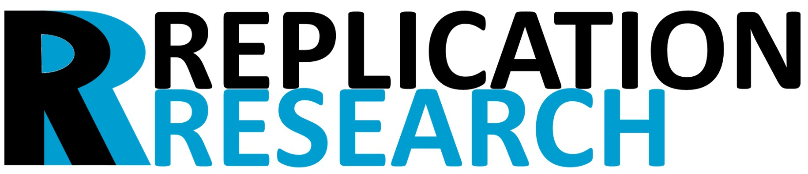
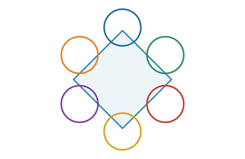
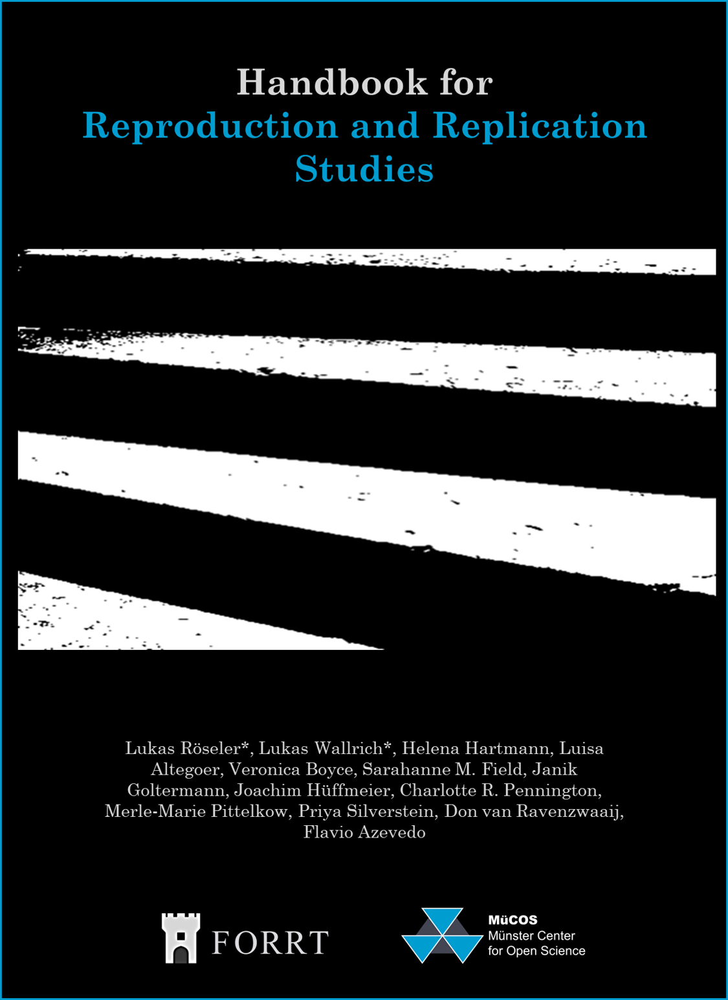
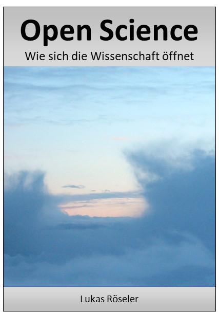
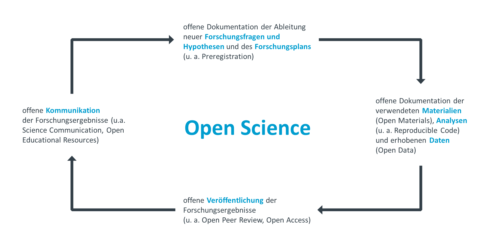
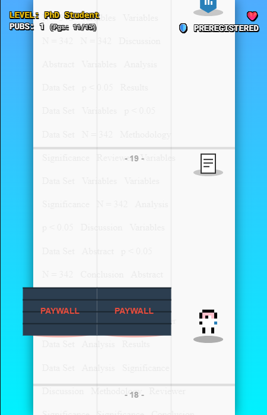
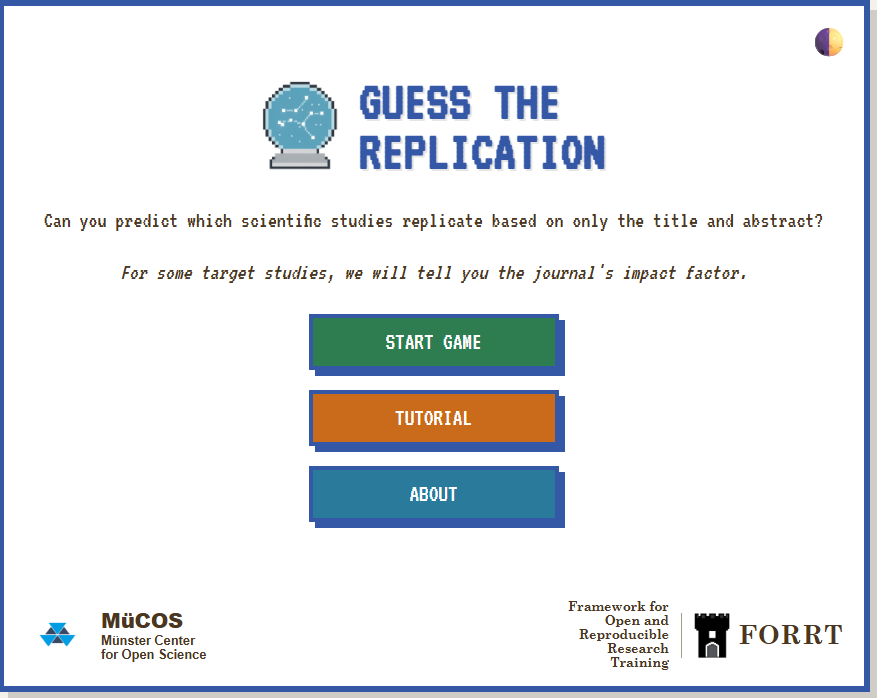

```{=html}
<!--
  ══════════════════════════════════════════
  WORD CLOUD
  ══════════════════════════════════════════
-->
<div id="wordcloud-wrapper">
  <canvas id="wc-canvas" width="900" height="230"
          style="width:100%;height:auto;display:block"></canvas>
  <p class="wc-note">My key research topics</p>
</div>
<script src="https://cdnjs.cloudflare.com/ajax/libs/wordcloud2.js/1.1.0/wordcloud2.min.js"></script>
<script>
document.addEventListener('DOMContentLoaded', function(){
  var words = [
    ['Anchoring Effects',34],['Replication',38],['Philosophy of Science',12],['Meta-Analysis',28],
    ['Open Science',26],['Judgment & Decision Making',22],['Reproducibility',20],
    ['Preregistration',17],['Replication Database',17],['Susceptibility',15],
    ['Adjustment',14],['Ego Depletion',12],['Open Data',11],
    ['Self-Control',11],['Body Position',10],['Effect Sizes',10],
    ['Meta-Science',22],['P-Hacking',9],['Publication Bias',8],
    ['Social Psychology',8],['Personality',7],['Dominance',7],
    ['Prestige',6],['Generalizability',6],['FLoRA',6],
    ['FORRT',18],['Validity',5],['Transparency',5],['Subliminal Priming',7]
  ];
  function css(v){ return getComputedStyle(document.documentElement).getPropertyValue(v).trim(); }
  function draw(){
    var c = document.getElementById('wc-canvas');
    if(!c) return;
    c.getContext('2d').clearRect(0,0,c.width,c.height);
    var a = css('--accent')||'#03a1fc', m = css('--text-muted')||'#5a6278';
    var pal = [a,a,a,m,m,a+'cc',a+'99',m+'dd',m+'bb'];
    WordCloud(c,{
      list:words,
      gridSize:Math.round(14*(c.offsetWidth/900)),
      weightFactor:function(s){return Math.pow(s,0.82)*(c.offsetWidth/900)*2.4;},
      fontFamily:'DM Sans,sans-serif',fontWeight:'600',
      color:function(){return pal[Math.floor(Math.random()*pal.length)];},
      rotateRatio:0,rotationSteps:1,backgroundColor:'transparent',
      drawOutOfBound:false,shrinkToFit:true,shuffle:false
    });
  }
  draw();
  new MutationObserver(function(){setTimeout(draw,80);})
    .observe(document.documentElement,{attributes:true,attributeFilter:['data-bs-theme']});
});
</script>

<!--
  ══════════════════════════════════════════════════════
  PROJECT SLIDESHOW  (Karteikarten)
  To add a card: copy a .project-card block and
  increment ssTotal in the script.
  ══════════════════════════════════════════════════════
-->
<div class="project-slideshow">
  <div class="project-cards-outer">
    <div class="project-cards-track" id="ss-track">

      <!-- CARD 1: FLoRA / FORRT Replication Hub -->
      <div class="project-card">
        <div class="card-logo-wrap">
          
        </div>
        <h3>FORRT Replication Hub &amp; FLoRA Database</h3>
        <p>I am a lead on the <strong>FORRT Replication Hub</strong>, home to
           <strong>FLoRA</strong> — the world's largest curated database of replication
           studies, tracking reproductions and replications across the sciences and
           humanities. Get in touch if you would like to contribute.</p>
        <a href="https://forrt.org/replication-hub" target="_blank" class="card-cta">
          <svg viewBox="0 0 24 24" fill="none" stroke="currentColor" stroke-width="2" stroke-linecap="round" width="13" height="13"><path d="M10 6H6a2 2 0 00-2 2v10a2 2 0 002 2h10a2 2 0 002-2v-4M14 4h6m0 0v6m0-6L10 14"/></svg>
          Visit FORRT Replication Hub
        </a>
      </div>

      <!-- CARD 2: Replication Research Journal -->
      <div class="project-card">
        <div class="card-logo-wrap">
          
        </div>
        <h3>Replication Research (R2) — Diamond Open Access Journal</h3>
        <p>Together with an interdisciplinary team of Open Science experts, I am founding
           and editing <strong>Replication Research (R2)</strong> — a diamond open access
           journal dedicated to replication and reproduction studies. No fees for authors
           or readers. Get in touch to submit or support the initiative.</p>
        <a href="https://replicationresearch.org" target="_blank" class="card-cta">
          <svg viewBox="0 0 24 24" fill="none" stroke="currentColor" stroke-width="2" stroke-linecap="round" width="13" height="13"><path d="M10 6H6a2 2 0 00-2 2v10a2 2 0 002 2h10a2 2 0 002-2v-4M14 4h6m0 0v6m0-6L10 14"/></svg>
          Visit Replication Research
        </a>
      </div>

      <!-- CARD 3: Replication Journal Federation -->
      <div class="project-card">
        <div class="card-logo-wrap">
          
          <span style="font-weight:700;font-size:1rem;color:var(--text);line-height:1.3;margin-left:10px;font-family:'DM Sans',sans-serif">Replication Journal<br>Federation</span>
        </div>
        <h3>Replication Journal Federation</h3>
        <p>I am coordinating the <strong>Replication Journal Federation</strong> — a
           growing international network of journals committed to publishing replication
           and reproduction studies. The Federation promotes cross-journal standards,
           visibility, and discoverability of replication research across disciplines.</p>
        <a href="https://forrt.org/rjf" target="_blank" class="card-cta">
          <svg viewBox="0 0 24 24" fill="none" stroke="currentColor" stroke-width="2" stroke-linecap="round" width="13" height="13"><path d="M10 6H6a2 2 0 00-2 2v10a2 2 0 002 2h10a2 2 0 002-2v-4M14 4h6m0 0v6m0-6L10 14"/></svg>
          Learn more
        </a>
      </div>

    </div>
  </div>

  <div class="slideshow-nav">
    <button class="ss-btn" onclick="ssPrev()" aria-label="Previous">
      <svg viewBox="0 0 24 24"><polyline points="15 18 9 12 15 6"/></svg>
    </button>
    <div class="ss-dots" id="ss-dots"></div>
    <button class="ss-btn" onclick="ssNext()" aria-label="Next">
      <svg viewBox="0 0 24 24"><polyline points="9 18 15 12 9 6"/></svg>
    </button>
  </div>
</div>

<script>
(function(){
  var ssTotal = 3; /* ← increment when adding cards */
  var track = document.getElementById('ss-track');
  var dotsEl = document.getElementById('ss-dots');
  var cur = 0, timer;
  for(var i=0;i<ssTotal;i++){
    (function(idx){
      var d = document.createElement('button');
      d.className = 'ss-dot'+(idx===0?' active':'');
      d.setAttribute('aria-label','Card '+(idx+1));
      d.addEventListener('click',function(){ ssGoTo(idx); });
      dotsEl.appendChild(d);
    })(i);
  }
  function ssGoTo(n){
    cur = ((n%ssTotal)+ssTotal)%ssTotal;
    track.style.transform = 'translateX(-'+cur*100+'%)';
    dotsEl.querySelectorAll('.ss-dot').forEach(function(d,i){
      d.classList.toggle('active',i===cur);
    });
    clearInterval(timer);
    timer = setInterval(function(){ ssGoTo(cur+1); },7000);
  }
  window.ssPrev = function(){ ssGoTo(cur-1); };
  window.ssNext = function(){ ssGoTo(cur+1); };
  timer = setInterval(function(){ ssGoTo(cur+1); },7000);
})();
</script>
```

<p style="font-family:&#39;DM Sans&#39;,sans-serif">

My research covers Replications, Meta-Science, and Judgment and Decision Making (e.g., Anchoring Effects).

</p>

```{=html}
<!--
  ══════════════════════════════════════════════════════════
  OPEN EDUCATIONAL RESOURCES  (4-column grid)
  To add a card: copy an <a class="oer-card"> block.
  ══════════════════════════════════════════════════════════
-->
<details class="collapsible-section" open>
<summary>
  <div class="coll-chevron"><svg viewBox="0 0 24 24"><polyline points="9 18 15 12 9 6"/></svg></div>
  <h2>Open Educational Resources</h2>
</summary>
<div class="section-body">

<div class="oer-grid">

  <!-- Card 1: Replication Handbook -->
  <a class="oer-card" href="https://forrt.org/replication_handbook" target="_blank">
    
    <div class="oer-body">
      <div class="oer-title">Handbook for Reproduction &amp; Replication Studies</div>
      <div class="oer-desc">Open access handbook co-authored with international experts. Covers methods, standards, and best practices for replication research.</div>
      <span class="oer-link">
        Read online
        <svg viewBox="0 0 24 24"><path d="M5 12h14M12 5l7 7-7 7"/></svg>
      </span>
    </div>
  </a>

  <!-- Card 2: German Open Science Book -->
  <a class="oer-card" href="https://lukasroeseler.github.io/opensciencebuch/" target="_blank">
    
    <div class="oer-body">
      <div class="oer-title">Open Science: Wie sich die Wissenschaft öffnet</div>
      <div class="oer-desc">A German-language open access book on Open Science — freely available online and continuously updated.</div>
      <span class="oer-link">
        Read online
        <svg viewBox="0 0 24 24"><path d="M5 12h14M12 5l7 7-7 7"/></svg>
      </span>
    </div>
  </a>

  <!-- Card 3: MueCOS Infomodule -->
  <a class="oer-card" href="https://lukasroeseler.github.io/MueCOS-Infomodule/" target="_blank">
    
    <div class="oer-body">
      <div class="oer-title">Interdisciplinary Open Science Guide (MueCOS)</div>
      <div class="oer-desc">An interdisciplinary guide to Open Science prepared with experts from the University of Münster. German, work in progress.</div>
      <span class="oer-link">
        Open guide
        <svg viewBox="0 0 24 24"><path d="M5 12h14M12 5l7 7-7 7"/></svg>
      </span>
    </div>
  </a>

  <!-- Card 4: Teaching slides / OSF repository -->
  <a class="oer-card" href="https://osf.io/at29b/" target="_blank">
    <div class="oer-pictogram">
      <svg viewBox="0 0 80 80" fill="none" xmlns="http://www.w3.org/2000/svg">
        <rect x="8" y="10" width="64" height="40" rx="4"
              fill="var(--bg-card2)" stroke="var(--accent)" stroke-width="2.5"/>
        <line x1="18" y1="24" x2="50" y2="24" stroke="var(--accent)" stroke-width="2" stroke-linecap="round" opacity=".7"/>
        <line x1="18" y1="32" x2="44" y2="32" stroke="var(--accent)" stroke-width="2" stroke-linecap="round" opacity=".5"/>
        <line x1="18" y1="40" x2="38" y2="40" stroke="var(--accent)" stroke-width="2" stroke-linecap="round" opacity=".35"/>
        <line x1="22" y1="50" x2="14" y2="68" stroke="var(--text-muted)" stroke-width="2.5" stroke-linecap="round"/>
        <line x1="58" y1="50" x2="66" y2="68" stroke="var(--text-muted)" stroke-width="2.5" stroke-linecap="round"/>
        <line x1="40" y1="50" x2="40" y2="68" stroke="var(--text-muted)" stroke-width="2" stroke-linecap="round" opacity=".5"/>
        <circle cx="62" cy="22" r="5" fill="var(--text-muted)" opacity=".6"/>
        <path d="M58 38 Q62 28 66 38" fill="var(--text-muted)" opacity=".45"/>
      </svg>
    </div>
    <div class="oer-body">
      <div class="oer-title">Workshops, Lectures &amp; Teaching Slides</div>
      <div class="oer-desc">Slides and materials from workshops, lectures, talks, and seminars on Open Science and replication methods. Hosted on OSF.</div>
      <span class="oer-link">
        Browse OSF repository
        <svg viewBox="0 0 24 24"><path d="M5 12h14M12 5l7 7-7 7"/></svg>
      </span>
    </div>
  </a>

</div><!-- /oer-grid -->
</div></details>
```

------------------------------------------------------------------------

```{=html}


<details class="collapsible-section">
<summary>
  <div class="coll-chevron"><svg viewBox="0 0 24 24"><polyline points="9 18 15 12 9 6"/></svg></div>
  <h2>Research Articles (Peer-Reviewed)</h2>
</summary>
<div class="section-body">
```

**2026**

-   Aczel, B., Szaszi, B., Clelland, H.T. *et al.* (2026). Investigating the analytical robustness of the social and behavioural sciences. *Nature, 652,* 135–142. <https://doi.org/10.1038/s41586-025-09844-9>

**2025**

-   Hoghe, J., **Röseler, L.**, Limmer, R., Walther, C., & Schütz, A. (2025). Die Bedeutung personaler Ressourcen und personaler Risikofaktoren für die Bewältigung beruflicher Belastungen bei Genesungsbegleiter/-innen/Peer Berater/-innen. *In Zeitschrift für Arbeitswissenschaft.* <https://doi.org/10.1007/s41449-025-00460-x>

-   Hoghe, J., **Röseler, L.**, Limmer, R., Walther, C., & Schütz, A (2025). Occupational stressors and resources of peer workers in social psychiatry. *Psychiatrische Praxis, 52*(1), 35-43. <https://doi.org/10.1055/a-2383-8057>

-   **Röseler, L.**, Incerti, L., Rebholz, T. R., Seida, C., & Papenmeier, F. (2025). Falsifying the insufficient adjustment model. *Meta-Psychology*, *9*. <https://doi.org/10.15626/MP.2024.4137>

-   Reed, W. R., **Röseler, L.**, Saam, M., & Wallrich, L. (2025). No Room at the Inn? *Journal of Behavioral and Experimental Economics*, 102502. <https://doi.org/10.1016/j.socec.2025.102502>

-   Hoghe, J., **Röseler, L.**, Limmer, R., Walther, C., & Schütz, A. (2025). Die Bedeutung personaler Ressourcen. *Zeitschrift für Arbeitswissenschaft.* <https://doi.org/10.1007/s41449-025-00460-x>

-   Weber, L., & **Röseler, L.** (2025). Testing the Reliability of Anchoring Susceptibility Scores. *Europe's Journal of Psychology*, *21*(1), 1-10. <https://doi.org/10.5964/ejop.9891>

**2024**

-   **Röseler, L.**, Bögler, H. L., Koßmann, L., Krueger, S. M., Bickenbach, S. L. C., Bühler, R., … Sing, J. (2024). Need for cognition, cognitive load, and forewarning do not moderate anchoring effects. A replication study of Epley & Gilovich (Journal of Behavioral Decision Making, 2005; Psychological Science, 2006). *Journal of Comments and Replications in Economics, 3*(8). <https://doi.org/10.18718/81781.38>

-   **Röseler, L.**, Felser, G., Asberger, J., & Schütz, A. (2024). The effect of variety on perceived quantity: Failures to replicate Redden and Hoch (2009). *Meta-Psychology, 8*. <https://doi.org/10.15626/MP.2020.2639>

-   **Röseler, L.**, Weber, L., Helgerth, K. A. C., Stich, E., Günther, M., Tegethoff, P., … Schütz, A. (2024). Measurements of susceptibility to anchoring are unreliable: Meta-analytic evidence from more than 50,000 anchored estimates. *Meta Psychology, 8*. <https://doi.org/10.15626/MP.2022.3236>

-   **Röseler, L.,** Kaiser, L., Doetsch, C., Klett, N., Seida, C., Schütz, A., … Zhang, Y. (2024). The Replication Database: Documenting the replicability of psychological science. *Journal of Open Psychology Data, 12*(1), 8. <https://doi.org/10.5334/jopd.101>

-   **Röseler, L.**, Felser, G., Asberger, J., & Schütz, A. (2024). The Effect of Variety on Perceived Quantity. *Meta-Psychology*, 8. <https://doi.org/10.15626/MP.2020.2639>

-   **Röseler, L.**, Weber, L., Helgerth, K., Stich, E., Günther, M., Tegethoff, P., … Schütz, A. (2024). Correction: The open anchoring quest dataset: Anchored estimates from 96 studies on anchoring effects. *Journal of Open Psychology Data, 12*(8), 1–3. <https://doi.org/10.5334/jopd.92>

**2023**

-   Adler, S. J., **Röseler, L.**, & Schöniger, M. K. (2023). A toolbox to evaluate the trustworthiness of published findings. *Journal of Business Research*, *167*, 114189. <https://doi.org/10.1016/j.jbusres.2023.114189>

**2022**

-   Delios, A., Clemente, E., Wu, T., Tan, H., Wang, Y., Gordon, M., Viganola, D., Chen, Z., Dreber, A., Johannesson, M., Pfeiffer, T., **Generalizability Tests Forecasting Collaboration**, & Uhlmann, E.L. (2022). Examining the context sensitivity of research findings from archival data. *Proceedings of the National Academy of Sciences*. <https://doi.org/10.1073/pnas.212037711>

-   Körner\*, R., **Röseler\*, L.**, Schütz, A., & Bushman, B. J. (2022). Dominance and prestige: Meta-analytic review of experimentally induced body position effects on behavioral, self-report, and physiological dependent variables. *Psychological Bulletin*. <https://doi.org/10.1037/bul0000356> \*shared first authorship

-   **Röseler, L.**, Weber, L., Helgerth, K., Stich, E., Günther, M., Tegethoff, P., Wagner, F., Antunovic, M., BarreraLemarchand, F., Halali, E., Ioannidis, K., Genschow, O., Milstein, N., Molden, D. C., Papenmeier, F., Pavlovic, Z., Rinn, R., Schreiter, M. L., Zimdahl, M. F., Bahník, Š., Bermeitinger, C., Blower, F. B. N., Bögler, H. L., Burgmer, P., Cheek, N. N., Dorsch, L., Fels, S., Frech, M.-L., Freira, L., Harris, A. J. L., Häusser, J. A., Hedgebeth, M. V., Henkel, M., Horvath, D., Intelmann, P., Klamar, A., Knappe, E., Köppel, L.-M., Krueger, S. M., Lagator, S., Lopez-Boo, F., Navajas, J., Norem, J. K., Novak, J., Onuki, Y., Page, E., Rebholz, T. R., Sartorio, M., Schindler, S., Shanks, D. R., Siems, M.-C., Stäglich, P., Starkulla, M., Stitz, M., Straube, T., Thies, K., Thum, E., Ueda, K., Undorf, M., Urlichich, D., Vadillo, M. A., Wolf, H., Zhou, A., & Schütz, A. (2022). The Open Anchoring Quest Dataset: Anchored Estimates from 96 Studies on Anchoring Effects. *Journal of Open Psychology Data, 10*(16), pp. 1–12. <http://doi.org/10.5334/jopd.67>

**2021**

-   Körner, R., **Röseler, L.**, & Schütz, A. (2021). Commentary on Elkjær et al.’s (2020) meta-analysis on expansive versus contractive nonverbal displays. *Perspectives on Psychological Science, 17*(1), 305–307. <https://doi.org/10.1177/1745691620984474>

-   Tierney, W., Hardy, J. H., III., Ebersole, C., Viganola, D., Clemente, E., Gordon, M., Hoogeveen, S., Haaf, J., Dreber, A.A., Johannesson, M., Pfeiffer, T., Chapman, H., Gantman, A., Vanaman, M., DeMarree, K., Igou, E., Wylie, J., Storbeck J., Andreychik, M.R., McPhetres, J., Vaughn, L.A., … **Röseler, L.,** … Uhlmann, E. L. (2021). A creative destruction approach to replication: Implicit work and sex morality across cultures. *Journal of Experimental Social Psychology, 93,* <https://doi.org/10.1016/j.jesp.2020.104060>

-   **Röseler, L.**, Ebert, J., Schütz, A., & Baumeister, R. F. (2021). The upsides and downsides of high self-control: Evidence for effects of similarity and situation dependency. *Europe's Journal of Psychology*, *17*(1), 1–16. <https://doi.org/10.5964/ejop.2639>

-   **Röseler, L.**, Schütz, A., Blank, P. A., Dück, M., Fels, S., Kupfer, J., Scheelje, L., & Seida, C. (2021). Evidence against subliminal anchoring: Two close, highly powered, preregistered, and failed replication attempts. *Journal of Experimental Social Psychology*, *92*, 104066. <https://doi.org/10.1016/j.jesp.2020.104066>

-   Wolf, D., Leder, J., **Röseler, L.**, & Schütz, A. (2021). Does Facial Redness Really Affect Emotion Perception? Evidence for Limited Generalisability of Effects of Facial Redness on Emotion Perception in a Large Sample. *Cognition and Emotion*. 35(8), 1607– <https://doi.org/10.1080/02699931.2021.1979473>

**2020**

-   Landy, J. F., Jia, M. L., Ding, I. L., Viganola, D., Tierney, W., Dreber, A., Johannesson, M., Pfeiffer, T., Ebersole, C. R., Gronau, Q. F., Ly, A., van den Bergh, D., Marsman, M., Derks, K., Wagenmakers, E.-J., Proctor, A., Bartels, D. M., Bauman, C. W., Brady, W. J., ... **Röseler, L.**, … Uhlmann, E. L. (2020). Crowdsourcing hypothesis tests: Making transparent how design choices shape research results. *Psychological Bulletin*, *146*(5), 451–479. <https://doi.org/10.1037/bul0000220>

-   **Röseler, L.** (2020, September). *Anchoring Effects: Resolving the Contradictions of Personality Moderator Research (Doctoral Thesis)*. University of Bamberg. <https://osf.io/34sv6>

-   **Röseler, L.**, Schütz, A., Baumeister, R. F., & Starker, U. (2020). Does ego depletion reduce judgment adjustment for both internally and externally generated anchors? *Journal of Experimental Social Psychology*, *87*, 103942. <https://doi.org/10.1016/j.jesp.2019.103942>

```{=html}
</div></details>

<details class="collapsible-section">
<summary>
  <div class="coll-chevron"><svg viewBox="0 0 24 24"><polyline points="9 18 15 12 9 6"/></svg></div>
  <h2>Research Articles (Preprints)</h2>
</summary>
<div class="section-body">
```

**2026**

-   Rebholz, T. R., Groß, J., **Röseler, L.,** (2026, February 10). Assimilation to External Cues: Comparing the Reliability of Anchoring Effects, Advice Taking, and Hindsight Bias and Exploring its Determinants. <https://doi.org/10.31234/osf.io/5u8br_v3>

    Wallrich, L., vaz, K. G., Weinerova, J., **Röseler, L.,** Gupta, A., Kan-Kilinc, B., … Azevedo, F. (2026, March 9). FLoRA-Notify: A Protocol for a Cluster-Randomised Controlled Trial to Assess the Impact of Notifying Preprint Authors About Replication Studies. <https://doi.org/10.31222/osf.io/qnckf_v1>

-   Hartmann, H., Azevedo, F., **Röseler, L.**, Wallrich, L., Aldoh, A., Elsherif, M. M., … Leech, G. (2026, March 12). Tracking and mainstreaming replications in the social, cognitive, and behavioral sciences. <https://doi.org/10.31222/osf.io/ad2w6_v2>

**2025**

-   **Röseler, L.** (2025, November 24). Preregistrations without Code do not Prevent P-Hacking. MetaArxiv. <https://doi.org/10.31222/osf.io/v259t_v1>

**2024**

-   **Röseler, L.** (2024). CODECHECK certificate 2024-005. <https://doi.org/10.5281/zenodo.13945051>

-   **Röseler, L.**, Doetsch, C. A., Förster, N., Bruzsa, A., Deublein, M., Rieger, E., Schmidt, C., Seitz, A., & Wild, A.(2024). No Evidence for the Affective Expectation Model: Replication of Geers and Lassiter (2003).  [ https://doi.org/10.31234/osf.io/akfzh](https://doi.org/10.31234/osf.io/akfzh)

-   **Röseler, L.** (2024). Exploring Categorical Colors. <https://doi.org/10.31234/osf.io/gj76p>

-   **Röseler, L.**, & Schütz, A. (2024). Assimilation and Contrast are Everywhere. <https://doi.org/10.31234/osf.io/krwcn>

**2023**

-   **Röseler, L.** (2023). *Predicting Replication Rates with Z-Curve: A Brief Exploratory Validation Study Using the Replication Database*. Advance online publication. <https://osf.io/preprints/metaarxiv/ewb2t>

**2022**

-   **Röseler, L.**, Gendlina, T., Krapp, J., Labusch, N., & Schütz, A. (2022). Successes and Failures of Replications: A Meta-Analysis of Independent Replication Studies Based on the OSF Registries. Advance online publication. <https://doi.org/10.31222/osf.io/8psw2>

-   Wolf, D., **Röseler, L.**, Leder, J., & Schütz, A. (2022). The Red-Anger Effect: Is it Nothing More Than Demand Characteristics? Advance online publication. <https://doi.org/10.31234/osf.io/ntukz>

-   **Röseler, L.**, & Schütz, A. (2022). Hanging the Anchor Off a New Ship: A Meta-Analysis of Anchoring Effects. <https://doi.org/10.31234/osf.io/wf2tn>

**2021**

-   **Röseler, L.**, Schütz, A. (2021). What You Expect is What You Get: The Role of Affective Expectations in Real-World Experiences. <https://doi.org/10.31219/osf.io/2tr6q>

**2020**

-   **Röseler, L.**, Schütz, A., Dolling, I. K., Friedinger, K., Hösch, Y., Hügel, J. C., Igna, E., Karg, A., Kühling, S., Schäffer, D., Zhou, A., & Röseler, J. J. (2020). The Stepwise Anchoring Paradigm: Measuring Reliable Components of Anchoring and Adjustment as the Next Step in Moderator Research. <https://doi.org/10.31234/osf.io/hjbwp>

    **Röseler, L.**, Wolf, D., Leder, J., & Schütz, A. (2020). Test-Retest Reliability is not a Measure of Reliability or Stability: A Friendly Reminder. <https://doi.org/10.31234/osf.io/mt49r>

**2019**

-   **Röseler, L.**, Schütz, A., & Starker, U. (2019). Cognitive Ability does not Correlate with Anchoring Susceptibility. <https://doi.org/10.31234/osf.io/bnsx2>

```{=html}
</div></details>

<details class="collapsible-section">
<summary>
  <div class="coll-chevron"><svg viewBox="0 0 24 24"><polyline points="9 18 15 12 9 6"/></svg></div>
  <h2>Books and Book Chapters</h2>
</summary>
<div class="section-body">
```

-   **Röseler, L.**\**,* Wallrich, L.\*, Hartmann, H., Hüffmeier, J., Goltermann, J., Pennington, C. R., Boyce, V., Field, S. M., Pittelkow, M.-M., Silverstein, P., van Ravenzwaaij, D., Azevedo, F. (2025). *Handbook for Reproduction and Replication Studies.* Retrieved from <https://forrt.org/replication_handbook>, <https://doi.org/10.5281/zenodo.16990114> \*shared first authorship
-   **Röseler, L.** (2025). Open Science: Wie sich die Wissenschaft öffnet (0.2). <https://doi.org/10.17605/OSF.IO/2QXWV>
-   Jané, M., Xiao, Q., Yeung, S., Ben-Shachar, M. S., Caldwell, A., Cousineau, D., ... & Feldman, G. (2024). Guide to effect sizes and confidence intervals. <https://doi.org/10.17605/OSF.IO/D8C4G>
-   **Röseler, L.**, & Schütz, A. (2022). Open Science. In A. Schütz, M. Brand, S. Steins-Loeber, (Eds.), *Psychologie: Eine Einführung in ihre Grundlagen und Anwendungsfelder* (6th ed., pp. 187–198). Kohlhammer.

```{=html}
</div></details>

<details class="collapsible-section">
<summary>
  <div class="coll-chevron"><svg viewBox="0 0 24 24"><polyline points="9 18 15 12 9 6"/></svg></div>
  <h2>Editorial Activities</h2>
</summary>
<div class="section-body">
```

-   **Röseler, L.**, Wallrich, L., Adler, S., Oppong Boakye, P., Evans, T. R., Goltermann, J., Haven, T., Horstmann, J., Korbmacher, M., Müller, M., Verheyen, S., Visser, I., & Azevedo, F. (2025). A Community Model for Rigorous and Inclusive Scholarship: Inaugural Editorial of Replication Research (R2). *Replication Research, 1*. <https://doi.org/10.17879/replicationresearch-2025-9022>
-   Müller, M., **Röseler, L.**, & Wallrich, L. (2025). Initial Editorial Assessment Form. Zenodo. <https://doi.org/10.5281/zenodo.17911973>
-   **Röseler, L.**, Wallrich, L., Adler, S., et al. (2025). Replication Research Constitution. Zenodo. <https://doi.org/10.5281/zenodo.17279413>
-   **Röseler, L.**, Wallrich, L., Adler, S., et al. (2025). Replication Research: Journal Description. Zenodo. <https://doi.org/10.5281/zenodo.17241396>

```{=html}
</div></details>

<details class="collapsible-section">
<summary>
  <div class="coll-chevron"><svg viewBox="0 0 24 24"><polyline points="9 18 15 12 9 6"/></svg></div>
  <h2>Software and Data</h2>
</summary>
<div class="section-body">
```

-   Wallrich, L.\**,* &**Röseler, L.\***, Hartmann, H., Ashcroft-Jones, S., Doetsch, C., Kaiser, L., Schüller, S. M., Aldoh, A., Behbood, H., Elsherif, M. M., Klett, N., Krapp, J., Liu, M., Pavlović, Z., Pennington, C. R., Schütz, A., Seida, C., Siziva, K., Skvortsova, A., Aczel, B., Adelina, N., Agostini, V., Al-Hoorie, A. H., Alarie, S., Albayrak-Aydemir, N., Alzahawi, S., Anvari, F., Arriaga, P., Baker, B. J., Barth, C. L., Bauer, D. J., Becker, R., Beitner, J., Belaus, A., Bhatt, H., Bhogal, J., Boyce, V., Breemer, L., Brick, C., Brohmer, H., Brummernhenrich, B., Budd, E., Butler, A., Casula, A., Chandrashekar, S. P., Chen, S., Chung, K. L., Cockcroft, J. P., Crowe, P., Cummins, J., Daniel, A., Deane, O., Deressa, T. K., Dienlin, T., Diveica, V., Draguns, A., Dumbalska, T., Efendic, E., El Halabi, M., Enright, S., Evans, T. R., Exner, A., Farrar, B. G., Feldman, G., Fillon, A., Floyd, J., Fontana Vieira, F., Frese, J., Förster, N., Gattie, M. C., Gemmecke, C., Genschow, O., Giannouli, V., Gjoneska, B., Gnambs, T., Gourdon-Kanhukamwe, A., Graham, C. J., Greshake Tzovaras, B., Guay, S., Hausenloy, J., Haviva, C., Henderson, E. L., Herderich, A., Hilbert, L., Holgado, D., Hussey, I., Höfer, L., Ilchovska, Z. G., Imada, H., Imwene, P., Izydorczak, K., Jaubert, S., Jeftić, A., Kalandadze, T., Kamermans, K., Karhulahti, V., Kasseckert, L., Kastrinogiannis, A., Klingelhöfer-Jens, M., Kocalar, H. E., Koppel, L., Koppold, A., Korbmacher, M., Kujawa, Z., Kulke, L., Kumar, P., Kuper, N., LaPlume, A. A., Lach, R., Lecuona, O., Lee, J., Leech, G., Leksina, E., Lin, C., Liu, Y., Lohkamp, F., Lou, N. M., Lynott, D., Mackinnon, S., Maier, M., Maiya, S., Makel, M. C., Manrique-Castano, D., Manríquez-Robles, D., Mathes, L., McSharry, D., Meidenbauer, K. L., Meier, M., Micheli, L., Miller, T., Montefinese, M., Moreau, D., Moser, N., Mrkva, K., Murphy, J., Muthu, J., Narkar, N., Nemcova, M., Nádvorník, J., O’Mahoney, R., O’Mahony, A., Oberholzer, Y., Oomen, D., Osano, M., Otstavnov, N., Packheiser, J., Pandey, S., Panton, H., Papenmeier, F., Parsons, S., Paruzel-Czachura, M., Pavlov, Y. G., Pittelkow, M., Plomp, W., Plonski, P. E., Pravednikov, A., Pronizius, E., Pua, A., Pypno-Blajda, K., Rausch, M., Raza, H., Reason, R., Rebholz, T. R., Resulbegoviq, H., Richert, E., Ross, R. M., Russo, S., Röer, J. P., Sandkühler, J. F., Schmidt, K., Sempere, N., Sobolak, R., Sperl, M. F., Stevens, J. R., Stogianni, M., Szekely, R., Tan, A. W., Thürmer, J. L., Tiulpakova, M., Tomczak, J., Tołopiło, A., Tunca, B., Vanpaemel, W., Vaughn, L. A., Verheyen, S., Vineyard, G. H., Weber, L., Weinberg, A., Wingen, S., Wolska, J., Yeung, S. K., Younssi, M., Zaneva, M., Zimmermann, D., Azevedo, F. (2026). FORRT Library of Replication Attempts (FLoRA) \[Data set\]. OSF. <https://doi.org/10.17605/OSF.IO/9R62X>

    **\* These authors contributed equally to this work.**

-   Tondlekar, R., Wallrich, L., Weinerova, J., Fouilloux, A., Baldoni, C., Meier, M., Flores Kanter, P. E., Paiva Trajano, I., Vaidis, D. C., Müller, M., Arriaga Ferreira, P., Coulson, H., Röseler, L., & FORRT. (2026). Zotero Replication Checker (0.1.12). Zenodo. <https://doi.org/10.5281/zenodo.18671300>

-   **Röseler, L.**, Wallrich, L. (2024). *FReD: Interfaces to the FORRT Replication Database.* <http://forrt.org/FReD/>

-   Hartmann\*, H., **Röseler**\*, L., Wallrich, L., Aldoh, A., Doetsch, C., Elsherif, M. M., Kaiser, L., Klett, N., Krapp, J., Liu, M., Pavlović, Z., Pennington, C. R., Seida, C., Skvortsova, A., Schütz, A., Aczel, B., Agostini, V., Al-Hoorie, A. H., Alarie, S., Anvari, F., Baker, B. J., Barth, C. L., Bauer, D. J., Beitner, J., Belaus, A., Boyce, V., Brick, C., Brohmer, H., Brummernhenrich, B., Butler, A., Chandrashekar, S., Chen, S., Chung, K., Cockcroft, J. P., Cummins, J., Dienlin, T., Diveica, V., Draguns, A., Dumbalska, T., Evans, T. R., Exner, A., Farrar, B. G., Feldman, G., Fillon, A., Fontana Vieira, F., Förster, N., Frese, J., Gattie, M. C., Genschow, O., Giannouli, V., Gjoneska, B., Gnambs, T., Graham, C. J., Greshake Tzovaras, B., Hausenloy, J., Henderson, E. L., Herderich, A., Hilbert, L., Höfer, L., Holgado, D., Hussey, I., Ilchovska, Z. G., Imada, H., Izydorczak, K., Jeftic, A., Kalandadze, T., Karhulahti, V., Kasseckert, L., Kastrinogiannis, A., Klingelhöfer-Jens, M., Kocalar, H. E., Koppel, L., Koppold, A., Korbmacher, M., Kulke, L., Kuper, N., LaPlume, A., Leech, G., Liu, Y., Lohkamp, F., Lou, N., Lynott, D., Meier, M., Mackinnon, S., Mathes, L., Meidenbauer, K. L., Micheli, L., Montefinese, M., Moreau, D., Muthu, J., Mrkva, K., Narkar, N., Nemcova, M., Oberholzer, Y., Oomen, D., Packheiser, J., Pandey, S., Papenmeier, F., Parsons, S., Paruzel-Czachura, M., Pavlov, Y. G., Pittelkow, M., Plomp, W., Plonski, P. E., Pronizius, E., Pua, A., Pypno-Blajda, K., Rausch, M., Rebholz, T. R., Röer, J. P., Ross, R. M., Schmidt, K., Sempere, N., Sperl, M. F., Stevens, J. R., Tan, A. W., Thürmer, J., Tiulpakova, M., Tołopiło, A., Tunca, B., Vanpaemel, W., Vaughn, L., Verheyen, S., Weber, L., Wolska, J., Yeung, S., Zaneva, M., Adelina, N., Albayrak-Aydemir, N., Alzahawi, S., Breemer, L., Efendic, E., El Halabi, M., Floyd, J., Gourdon-Kanhukamwe, A., Guay, S., Haviva, C., Jaubert, S., Kamermans, K., Lecuona, O., Lin, C., Maier, M., Makel, M. C., O'Mahony, A., Richert, E., Tomczak, J., Vineyard, G. H., Weinberg, A., Zimmermann, D., Azevedo, F. (2024). FReD: FORRT Replication Database, version 2.4.0. \[https://dx.doi.org/10.17605/OSF.IO/9r62x\] \*shared first authorship

-   Röseler, L., Weber, L., Helgerth, K. A. C., Stich, E., Günther, M., Tegethoff, P., Wagner, F. S., Ambrus, E., Antunovic, M., Barrera, F., Halali, E., Ioannidis, K., McKay, R., Milstein, N., Molden, D. C., Papenmeier, F., Rinn, R., Schreiter, M. L., Zimdahl, M., Allen, E., Bahník, S., Baumeister, R. F., Bermeitinger, C., Bickenbach, S. L. C., Blank, P. A., Blower, F. B. N., Bögler, H. L., Boo, F. L., Boruchowicz, C., Bühler, R. L., Burgmer, P., Cheek, N., N., Dohle, S., Dorsch, L., Dück, M. S., Fels, S.-A., Fischer, A. L., Frech, M.-L., Freira, L., Friedinger, K., Genschow, O., Harris, A., Hartig, B., Häusser, J. A., Hedgebeth, M., Henkel, M., Horvath, D., Hügel, J. C., Igna, E. L. E., Imhoff, R., Intelmann, P., Karg, A. H., Klamar, A., Klein, C., Klusmann, B., Knappe, E., Köppel, L.-M., Koßmann, L., Kraft, P., Kroworsch, M. K., Krueger, S. M., Kühling, S., Lagator, S., Lammers, J., Loschelder, D. D., Navajas, J., Norem, J., K., Novak, J. Onuki, Y., Page, E., Panse, F., Pavlovic, Z., Pearton, J., Rebholz, T. R., Rodgers, S., Röseler, J. J., Rostekova, A., Roßmaier, K. V., Sartorio, M., Scheelje, L., Schindler, S., Schreiner, N. B., Seida, C., Shanks, D. R., Siems, M.-C., Stitz, M., Starkulla, M., Stäglich, M., Thies, K., Thum, E., Undorf, M., Unger, B. D., Urlichich, D., Vadillo, M. A., Wackershauser-Sablotny, V., Wessel, I., Wolf, H., Zhou, A., & Schütz, A. (2022). *OpAQ: Open Anchoring Quest, Version 1.1.50.97*. <https://dx.doi.org/10.17605/OSF.IO/YGNVB>

-   **Röseler, L.**, Adler, S., Schöniger, M. (2022). A Toolbox to Identify P-Hacking. <https://metaanalyses.shinyapps.io/toolbox/>

-   **Röseler, L.**, Körner, R., & Schütz, A. (2021). Dynamic Meta-Analysis of Body Position Effects. <https://metaanalyses.shinyapps.io/bodypositions/>

-   **Röseler, L.**, Röseler, J. J. (2020). Studienfeedback ShinyApp. <https://l-air.shinyapps.io/feedback/>

```{=html}
</div></details>

<details class="collapsible-section">
<summary>
  <div class="coll-chevron"><svg viewBox="0 0 24 24"><polyline points="9 18 15 12 9 6"/></svg></div>
  <h2>Serious Games</h2>
</summary>
<div class="section-body">
```

-   **Tenure Run**: An endless runner game with a comical take on the "publish or perish" treadmill early-career researchers must navigate. Collect pages for papers, evade paywalls and teaching. Available at <https://forrt.org/tenure-run/>.\
    {width="200"}

-   **Guess the Replication** (co-developed with Jessica Röseler): Inspired by [Guess the Correlation](https://www.guessthecorrelation.com) and based on [FLoRA](https://forrt.org/replication-hub/flora/), players must guess whether a presented study (title and abstract) could successfully be replicated or not. Available at <https://lukasroeseler.github.io/GuessTheReplication/>. {width="400"}

```{=html}
</div></details>

<details class="collapsible-section">
<summary>
  <div class="coll-chevron"><svg viewBox="0 0 24 24"><polyline points="9 18 15 12 9 6"/></svg></div>
  <h2>Research Proposals</h2>
</summary>
<div class="section-body">
```

| Proposal | Year | Role | Program & Funder | Link | Status |
|------------|------------|------------|------------|------------|------------|
| Moderators of Anchoring Effects | 2022 | First author | DFG, Sachbeihilfe | [osf.io/x6bqh](https://osf.io/x6bqh/) | Rejected |
| Formation of a Replication Journal | 2024 | First author | Topical Program, Uni Münster | [osf.io/9vgx7](https://osf.io/9vgx7/) | Accepted |
| Diamond Open Access Journal Support | 2024 | First author | openaccess.nrw | [osf.io/a82fe](https://osf.io/a82fe) | Accepted |
| Diamond OA Journal (expression of interest) | 2025 | First author | ZBW Olecon | — | Rejected |
| Expanding the Replication Database | 2023 | First author | Ideenlabor, Uni Münster | [osf.io/854vt](https://osf.io/854vt/) | Rejected |
| Expanding the FORRT Replication Database | 2024 | Second author | DFG, Meta-REP | — | Rejected |
| University-wide Open Science Strategy | 2024 | Second author | Road2Openness, Stifterverband | — | Rejected |
| Making Replications Count | 2024 | Co-Investigator | UKRI | — | Accepted |
| Breaking the Wall of the Urge for Innovation | 2025 | Shared first author | Falling Walls Lab Münster | [osf.io/f486v](https://osf.io/f486v) | Rejected |
| The Age of Replications: Establishing a Multidisciplinary Diamond Open Access Infrastructure and Community Portal | 2026 | First author | DFG LIS | <https://doi.org/10.5281/zenodo.20270092> | Under review |

```{=html}
</div></details>

<details class="collapsible-section">
<summary>
  <div class="coll-chevron"><svg viewBox="0 0 24 24"><polyline points="9 18 15 12 9 6"/></svg></div>
  <h2>Invited Talks</h2>
</summary>
<div class="section-body">
```

-   **Röseler, L.** (2025, July). Building your career on solid ground. Keynote, 1st Oldenburg Open Science Conference. <https://osf.io/u7f2e>
-   **Röseler, L.** (2025, May). Panelist, Future of Open Science. SIPS online 2025. <https://www.youtube.com/watch?v=MpLbeLTcw6E>
-   **Röseler, L.** (2025, March). The FORRT Replication Hub. RWI Essen. <https://osf.io/9fkw7>
-   **Röseler, L.** (2024, November). Die FORRT Replication Hub. TU Dortmund. <https://osf.io/g3wke>
-   **Röseler, L.** (2024, September). Creating the Münster Center for Open Science. Mannheim. <https://osf.io/ha46c>
-   **Röseler, L.** (2024, August). Open Science als Annäherung. Open Access NRW. <https://osf.io/sv9xw>
-   **Röseler, L.** (2022, August). How to resist anchoring? Seeburg Castle University, Austria.
-   **Röseler, L.** (2022, June). The Open Anchoring Quest. Leuphana University, Lüneburg.
-   **Röseler, L.** (2022, April). Die Open Science Bewegung in der Psychologie. Harz University.
-   **Röseler, L.** (2020, August). Auflösung der Widersprüche aus Ankereffekt-Forschung. University of Magdeburg.

```{=html}
</div></details>

<details class="collapsible-section">
<summary>
  <div class="coll-chevron"><svg viewBox="0 0 24 24"><polyline points="9 18 15 12 9 6"/></svg></div>
  <h2>Presentations</h2>
</summary>
<div class="section-body">
```

-   **Röseler, L.** (2026). Replication Journal Showcase: R2. Love Replications Week. <https://doi.org/10.5281/zenodo.18864153>
-   **Röseler, L.** (2026). Getting your replication report ready. LRW, Online. <https://doi.org/10.5281/zenodo.18757230>
-   **Röseler, L.** (2025). Metascience won't solve the replication crisis. Metascience online 2025. <https://osf.io/zq2rc>
-   **Röseler, L.** (2025). We cannot solve the replication crisis without replications. SIPS 2025. <https://osf.io/xat5s>
-   **Röseler, L.** (2025). Das Münster Center for Open Science. CDSC Colloquium. <https://osf.io/hwbf6>
-   **Röseler, L.** (2024). Die Bedeutung von Replikationen. Philosophy of Science Lecture Series. <https://osf.io/zexb7>
-   **Röseler, L.** (2024). The FORRT Replication Database. DGPs-Kongress. <https://osf.io/wec8t>
-   **Röseler, L.** (2024). Creating a Nexus for Replication Research. Year of Open Science Conference. <https://osf.io/n5vae>
-   **Röseler, L.**, Wallrich, L., & Bushman, B. J. (2023). Creating interactive ShinyApps for Meta-Analyses. ESMARConf. <https://www.youtube.com/watch?v=yRmjBBiE2Io>

```{=html}
</div></details>

<details class="collapsible-section">
<summary>
  <div class="coll-chevron"><svg viewBox="0 0 24 24"><polyline points="9 18 15 12 9 6"/></svg></div>
  <h2>Posters</h2>
</summary>
<div class="section-body">
```

-   **Röseler, L.**, Moser, V., & Oppong Boakye, P. (2026). Münster Center for Open Science. Zenodo. <https://doi.org/10.5281/zenodo.18537522>
-   Hoghe, J., **Röseler, L.**, et al. (2022). Die sozialpsychiatrische Versorgungsorganisation. DKVF. <https://doi.org/10.3205/22dkvf185>
-   **Röseler, L.**, et al. (2020). Tidying up the Anchoring Shelf. 62nd Conference of Experimental Psychologists. <https://doi.org/10.13140/RG.2.2.24734.89928/1>

```{=html}
</div></details>

<details class="collapsible-section">
<summary>
  <div class="coll-chevron"><svg viewBox="0 0 24 24"><polyline points="9 18 15 12 9 6"/></svg></div>
  <h2>Workshop and Conference Materials</h2>
</summary>
<div class="section-body">
```

-   **Röseler, L.** (2026). Love Replications Week, online. <https://forrt.org/LoveReplicationsWeek/>
-   **Röseler, L.** (2025). Workshop on Open Science as a Career Asset. CER, Münster. <https://osf.io/g7yz4>
-   **Röseler, L.**, Moser, V., Schüller, S., & Förster, C. (2025). Replication Research Symposium: Book of Abstracts. <https://doi.org/10.5281/zenodo.15487804>
-   **Röseler, L.**, & Hätscher, O. (2025). Opening up your research with OSF and Github. FDM-Werkstatt. <https://osf.io/gwkfm>
-   **Röseler, L.** (2024). Workshop on Preregistration, CER Münster. <https://osf.io/64teq>

```{=html}
</div></details>

<details class="collapsible-section">
<summary>
  <div class="coll-chevron"><svg viewBox="0 0 24 24"><polyline points="9 18 15 12 9 6"/></svg></div>
  <h2>Blog Posts &amp; Science Communication</h2>
</summary>
<div class="section-body">
```

-   "Metascience Matters" Podcast on replications and publishing. <https://www.youtube.com/watch?v=PSVNZ-OFj3U>
-   Interview for Open Economics Blog: "R2: A New Home for Replication Research - Plus Tips for Getting Started". <https://openeconomics.zbw.eu/en/2026/06/r2-a-new-home-for-replication-research-plus-tips-for-getting-started>
-   Blog Post on RORi's Go Meta! Blog: "Did you know this study was replicated?" <https://researchonresearchinstitute.substack.com/p/did-you-know-this-study-was-replicated>
-   Q&A for COS Blog: "Building a Publishing Model for Replication." <https://www.cos.io/blog/building-a-publishing-model-for-replication-qa-with-the-senior-editors-of-replication-research>
-   Interview for Laborjournal. "Wiederholung wird gesellschaftsfähig." <https://www.laborjournal.de/editorials/3363.php>
-   Interview for University of Münster Newsportal. "Das System ist nicht auf Wiederholungen ausgelegt." <https://www.uni-muenster.de/news/view.php?cmdid=15002&lang=de>
-   Interview for Nature Index. "No more hunting for replication studies." <https://doi.org/10.1038/d41586-024-02598-w>
-   Interview on FORRT's activities for the ZBW. <https://open-science-future.zbw.eu/en/forrt-open-science-initiative/>
-   Blog post on the FORRT Replication Hub, The Replication Network. <https://replicationnetwork.com/2025/02/08/roseler-replication-research-symposium-and-journal/>

```{=html}
</div></details>

<details class="collapsible-section">
<summary>
  <div class="coll-chevron"><svg viewBox="0 0 24 24"><polyline points="9 18 15 12 9 6"/></svg></div>
  <h2>Awards</h2>
</summary>
<div class="section-body">
```

-   2026: [SIPS](https://improvingpsych.org/mission/awards/) Mission Award for the journal Replication Research
-   2026: [SIPS](https://improvingpsych.org/mission/awards/) Commendation for the Love Replications Week
-   2024: Promotional award of the [German Psychological Association](https://www.dgps.de/die-dgps/preise-und-ehrungen/foerderpreis-qualitaetssicherung-in-der-psychologie/) for quality assurance in psychology
-   2023: [SIPS](https://improvingpsych.org/mission/awards/) Commendation for the Replication Database
-   2022: Dissertation price of the Hans-Löwel Foundation for early career researchers at the University of Bamberg
-   2021: Dissertation price of the Rotary Club Bamberg-Schloß Geyerswörth for early career researchers of the University of Bamberg
-   2017: Award for the best thesis from the support association of the Harz University of Applied Sciences

```{=html}
</div></details>
```